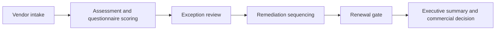
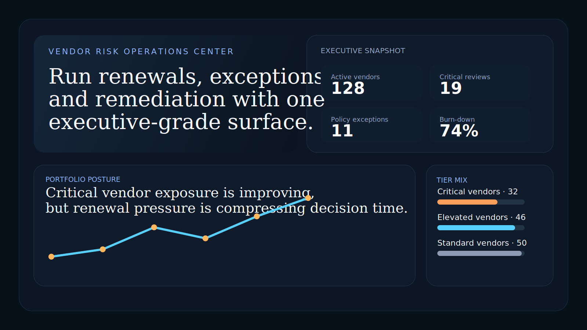
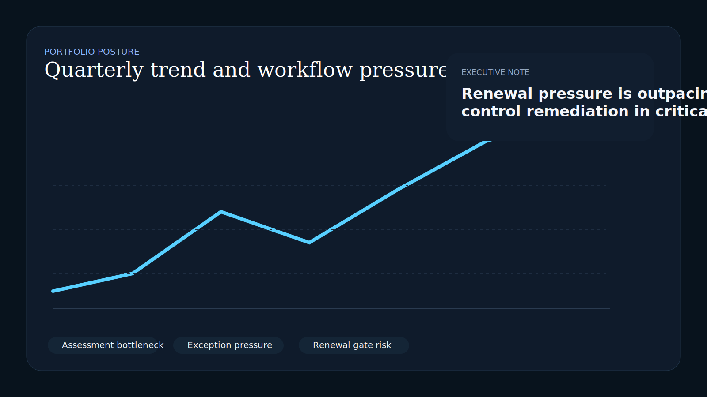
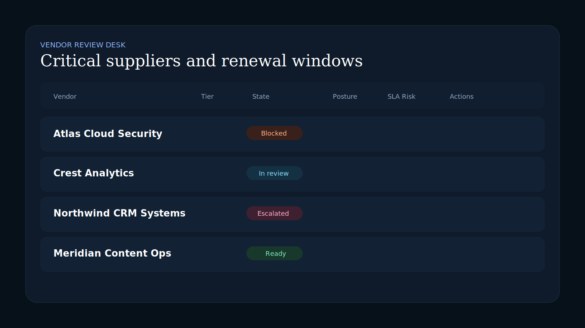
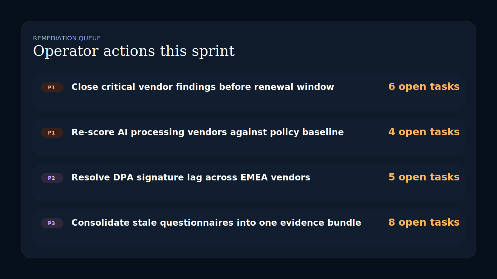

# Vendor Risk Operations Center

Enterprise-facing React + TypeScript control surface for third-party risk reviews, policy exceptions, remediation sequencing, and renewal pressure management.

## Recruiter Takeaway

This project demonstrates operator-grade frontend systems design for security, compliance, procurement, and leadership stakeholders. It translates vendor risk posture into clear workflow pressure, remediation priorities, and executive-ready visibility instead of burying everything in audit spreadsheets.

## Tech Stack

[](https://react.dev/)
[](https://vite.dev/)
[](https://www.typescriptlang.org/)
[](https://developer.mozilla.org/en-US/docs/Web/CSS)
[](https://vitest.dev/)
[](https://opensource.org/license/mit)

## Overview

| Area | What it covers |
| --- | --- |
| Executive posture | Portfolio health, renewal pressure, and exception backlog |
| Review operations | Intake, assessment, exception review, remediation, renewal gating |
| Vendor desk | Tiering, review status, posture score, SLA pressure, open actions |
| Remediation queue | High-priority operator actions and owner routing |
| Exception management | Policy waivers, evidence gaps, and legal/privacy dependencies |

## Business Problem

Third-party risk work usually lives across questionnaires, ticket queues, spreadsheets, legal comments, and renewal calendars. That creates slow reviews, executive surprises, and unnecessary renewal risk.

Vendor Risk Operations Center reframes that problem as an operator-facing command surface:

- show where review pressure is actually accumulating
- expose the vendors that are nearing renewal with unresolved findings
- surface exceptions that need leadership, privacy, or legal intervention
- give compliance and security operators a clearer remediation queue

## What An Engineering Leader Sees Here

- A real internal-tool interface rather than a generic dashboard shell
- Strong information hierarchy for executive and operator audiences
- Workflow-aware data modeling that mirrors real governance stages
- Deliberate typography, state treatment, and chart styling
- Documentation that explains architecture and operational decision flow

## Architecture



## Real-World Workflow

1. A vendor enters intake with a due diligence trigger.
2. Security, privacy, or legal findings move the record into assessment.
3. Policy exceptions or stale control evidence escalate the review.
4. Operators sequence remediation before the renewal window collapses.
5. Leadership gets a cleaner view of vendor exposure, blockers, and action owners.

## Screenshots

### Hero Capture



### Portfolio Posture



### Review Desk



### Remediation Queue



## Local Run

```powershell
Set-Location "C:\Users\chaus\dev\repos\vendor-risk-operations-center"
npm install
npm test
npm run build
npm run dev
```

## Project Structure

```text
src/
  App.tsx
  data.ts
  styles.css
  App.test.tsx
docs/
  architecture.md
screenshots/
  01-hero.svg
  02-posture.svg
  03-desk.svg
  04-queue.svg
```

## Portfolio Links

- [Kinetic Gain](https://kineticgain.com/)
- [Skills / Portfolio](https://mizcausevic.com/skills/)
- [LinkedIn](https://www.linkedin.com/in/mirzacausevic)
- [Medium](https://medium.com/@mizcausevic)
- [GitHub](https://github.com/mizcausevic-dev)
