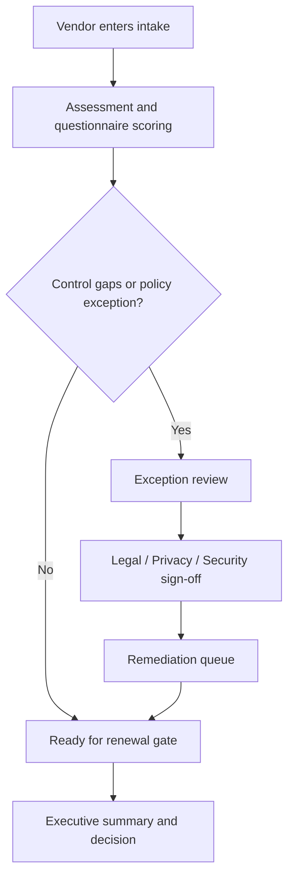

# Architecture Notes

## Product Intent

Vendor Risk Operations Center is intentionally structured like an internal command surface instead of a marketing dashboard. The goal is to make vendor governance pressure easy to interpret for multiple audiences:

- compliance operators
- security reviewers
- privacy and legal partners
- procurement or renewal owners
- executive stakeholders

## UX Blocks

- **Hero panel**: frames the product and gives leadership a clear reason to care.
- **Executive snapshot**: communicates raw pressure quickly.
- **Scorecards**: summarize review quality and renewal risk.
- **Posture trend**: shows whether the portfolio is improving or regressing.
- **Vendor desk**: exposes the critical review queue in a scannable table.
- **Workflow stages**: highlights where work is piling up.
- **Exceptions**: keeps policy waivers and evidence gaps visible.
- **Remediation queue**: prioritizes operational next steps.

## Workflow Map

## Data Modeling Notes

The data model is deliberately small but representative:

- `heroMetrics` powers executive summary cards
- `scorecards` summarizes portfolio-level signals
- `tierMix` supports risk distribution visuals
- `vendors` drives the review desk
- `workflowStages` communicates operational backlog
- `exceptions` makes approval pressure visible
- `remediationQueue` converts findings into next actions
